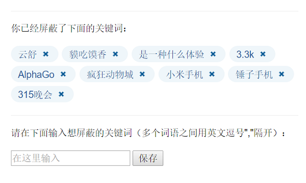
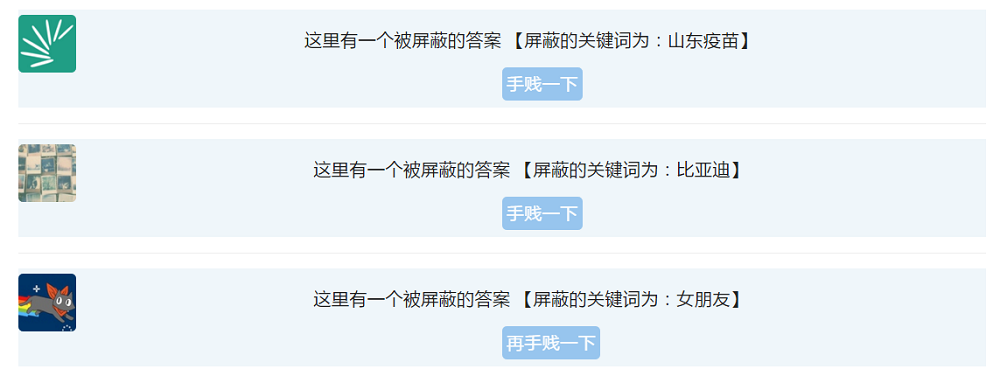

这是一个用于知乎网站的Chrome扩展，用于屏蔽网站首页的时间线上不感兴趣的内容。

因为知乎的设置，一个问题只能添加5个话题，而且屏蔽的话题也有上限，所以有时屏蔽了相关话题不能够保证问题不会出现在时间线上。

这个扩展会检测首页的每个答案，如果题目或答案中出现了你想要屏蔽的关键词，这个答案会默认隐藏，当然你也可以点击按钮重新查看答案。

在如下页面修改需要屏蔽的词语：

屏蔽后的答案如下所示：

相关博客：
[开发一个用于屏蔽知乎网内容的Chrome扩展](http://www.wukai.me/2016/03/25/chrome-extension-zhihufilter/)

### 尚未开发功能及需要改进的地方：

- 除了首页外，问题页面是否需要屏蔽关键词

- 加入和删除关键词时增加一个淡出的提示

- 可以选择是否显示问题部分

- 在右键菜单中加入增加关键词的选项

- 正则表达式支持

- icon是显示在地址栏的外部，而不是内部的最右侧（似乎是新版的Chrome特性）
